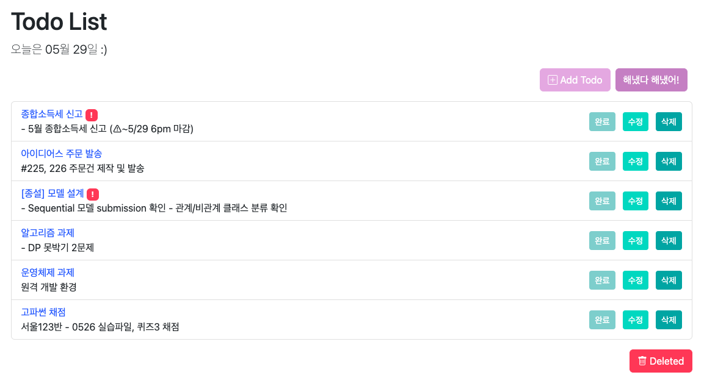

## ✔️ Django로 Todo-list 만들기 


<br>

### 1. FE/BE 한번에 개발하지 않고 나누는 이유
- 역할을 분리해서 개발하면 <b>여러명이 동시에 병렬적으로</b> 작업할 수 있음
    - 효율성, 생산성 🆙
- 모듈화를 통해 수정, 디버깅이 용이하다! <b>해당 부분만</b> 찾아서 수정 해주면 되기 때문
- 마찬가지로 각 부분만 독립적으로 개발되기 때문에 <b>유연한 확장 및 업데이트</b>가 가능함!!

<br>

### 2. Add todo 에서 할 일을 작성했을 때 '백엔드로 공부하기'가 제목인 이유

`>todo` `>models.py` 에서 title을 return값으로 했기 때문!

```python
from django.db import models

# todo->models.py
# Create your models here.

class Todo(models.Model):
    title = models.CharField(max_length=100)
    description = models.TextField(blank=True)
    created = models.DateTimeField(auto_now_add=True)
    complete = models.BooleanField(default=False)
    important = models.BooleanField(default=False)

    def __str__(self):
        return self.title
```

  -> 여기서 `return self.description`으로 바꾸면 상세 내용이 표시된다

<br>

### 3. templates 안에 todo 폴더를 만들어서 템플릿을 따로 관리하는 이유
- 위와 비슷하게 templates 폴더 안에 각 앱의 폴더를 따로 만들면 관리가 용이하다!
- 대규모 서비스의 경우 여러개의 앱이 있을 수 있기 때문에 구분함으로써 프로젝트의 구조가 명확해짐 
    - 식별 & 가독성 🆙
- 역시 항상 중요한 모듈화,,